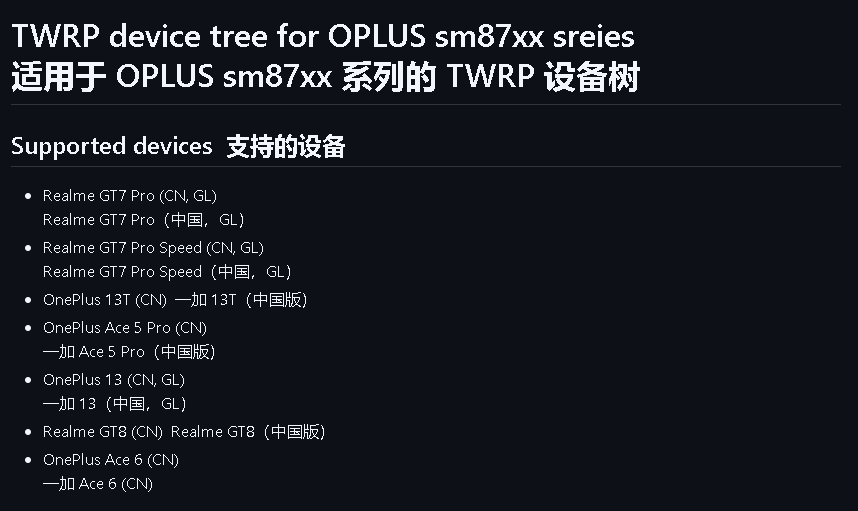
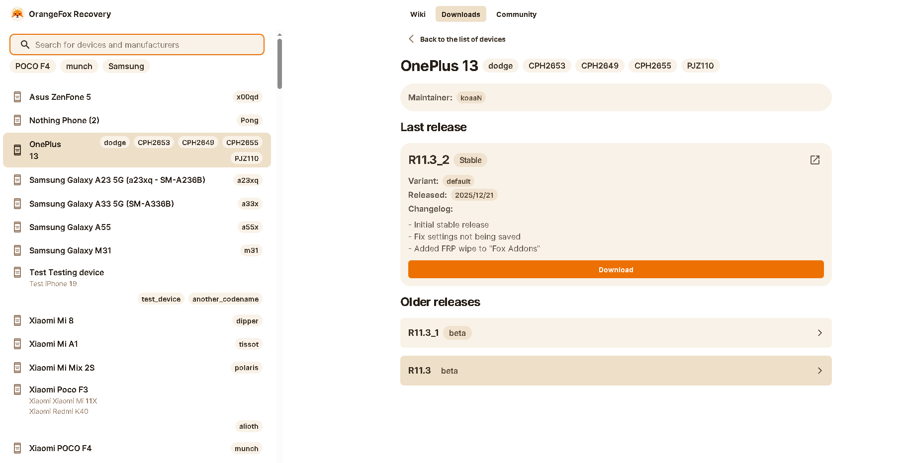
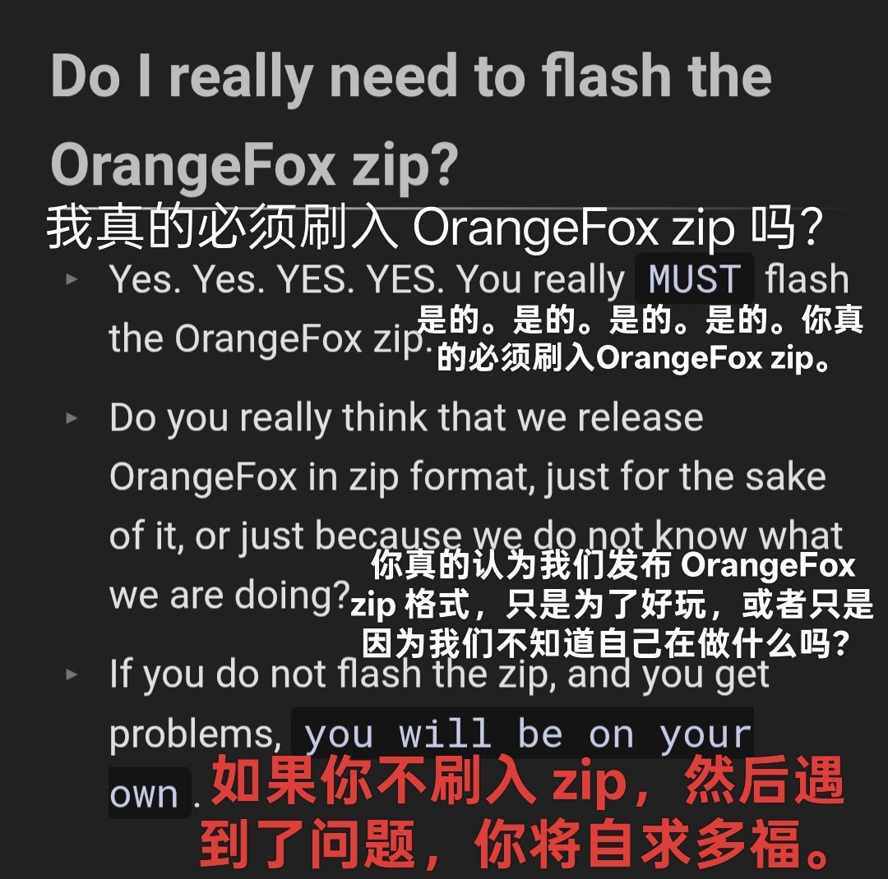
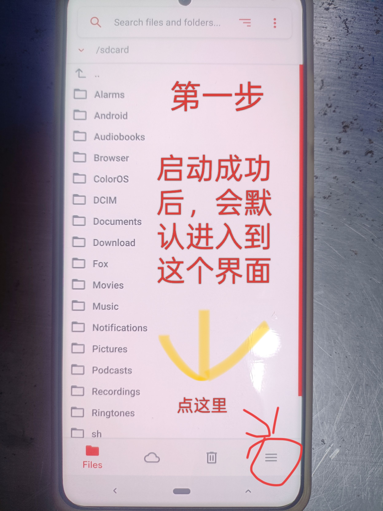
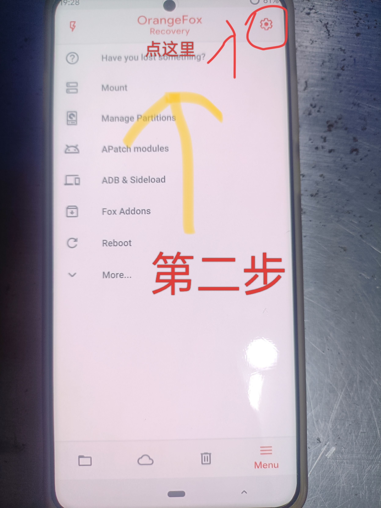
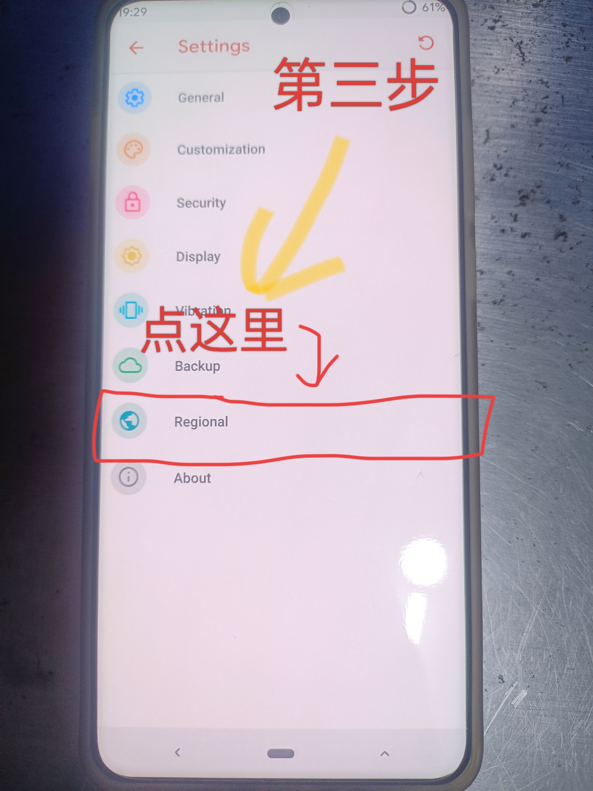
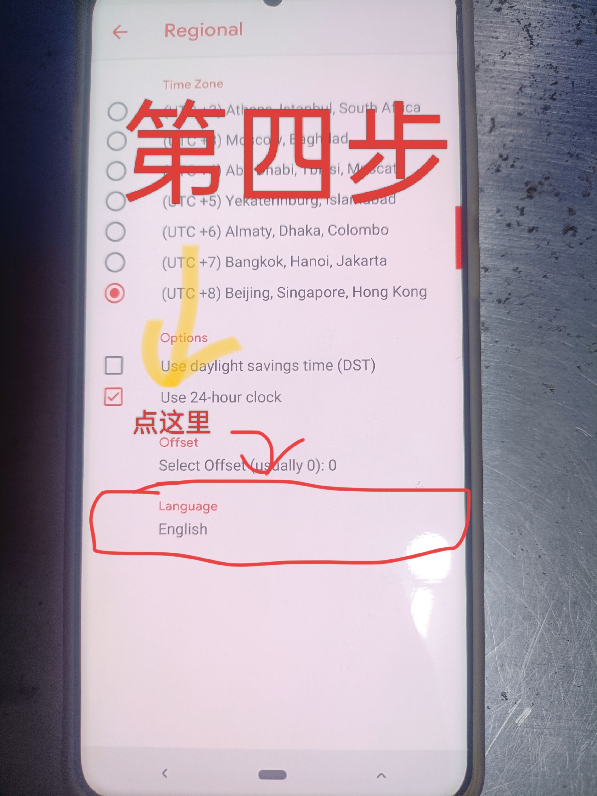
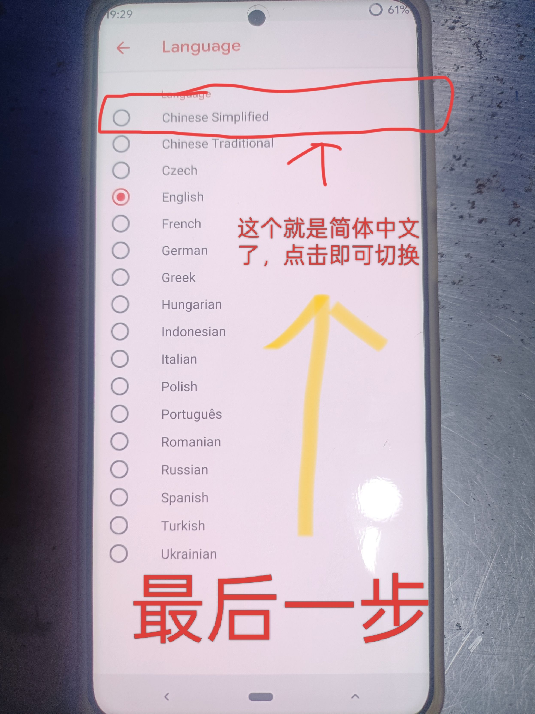

# Oplus-SM8750-TWRP-OrangeFox-Universal-Guide
[2026] 欧加骁龙 8 至尊 (SM8750) 系列 TWRP &amp; OrangeFox 刷入指南。 支持机型： 一加 13 (OnePlus 13), 一加 Ace 5 Pro, 真我 GT7 Pro, 一加 13T, 真我 GT8, 一加 Ace 6. 包含： 中文设置教程、9008 熔断警告及救砖工具。
# 一加 13 第三方 Recovery (TWRP+橙狐) 刷入与中文设置全攻略

> **⚠️ 严重警告：**
> **一加、真我、绿厂（OPPO）的高通机型用户，千万别更新系统！！！**
> 1. 几乎所有高通机型都可以免授权 9008，8 至尊及以下均支持（8 尊 5 未知）。
> 2. 其中绿厂 X7U、X6P、N3 以及其他老高通机型可以解锁 BL，X8U 虽然可以 9008 但暂不支持解锁。
> 3. **升级系统会导致该机 9008 免授权被永久熔断，且降级无效！**
> 4. 升级过 9 月补丁的骁龙 8+、778G、768G、865、870 机型，已经被熔断（865、870 的熔断版本可能更早）。
> 5. 就算你的机器已经停更也不能幸免，OPPO 还会特意推一个小更新来进行熔断，**被熔断后终身无法恢复**。
> 6. **对于欧加真玩机来说，9008 免授权非常重要，如果你的手机 OCDT 损坏（例如遭遇格机）售后无法帮你救砖，你必须拆字库才能救好。**
> 7. **【2026.1.15 最新熔断警告】：一加 13 和一加 13T 已推送熔断版本，版本号是 16.0.3.501，如果更新了该版本，会导致 9008 免授权被永久不可逆熔断，终身无法恢复，其余机型也即将推送熔断版本。从 2026.1.14 开始，所有一加手机请不要更新任何新版本否则都会永久不可逆熔断。**

---

## 简介
**一加 13 的刷机玩家有福了！**
TWRP 和橙狐 Recovery 均已适配该机型，结合最新的适配信息和中文设置教程（仅针对橙狐，TWRP 网上教程一堆），这篇攻略帮你一步到位！

*原作者酷安 @CHINA20499402。由于酷安大量优质帖子无法在浏览器中搜索到，为了方便各位机友检索，故转载至 Github，感谢原作者对机圈做出的贡献。*

*(不想看废话？资源放在文章末尾)*

---

## 一、适配情况概览

> **🚀 通用性说明 (Universal Support)：**
> 本教程提供的 TWRP 资源基于 **OPLUS SM87xx** 统一设备树，理论上支持以下所有 **骁龙 8 至尊 (Snapdragon 8 Elite)** 机型：
>
> | 品牌 (Brand) | 机型名称 (Model) | 备注 |
> | :--- | :--- | :--- |
> | **OnePlus** | OnePlus 13 (一加 13) | 本教程演示机型 |
> | **OnePlus** | OnePlus 13T | |
> | **OnePlus** | OnePlus Ace 5 Pro | |
> | **OnePlus** | OnePlus Ace 6 | |
> | **Realme** | Realme GT7 Pro / Speed | 真我 GT7 Pro 系列 |
> | **Realme** | Realme GT8 | 真我 GT8 |
>
> *注：虽然 TWRP 文件通用，但不同机型的刷入命令可能略有差异，非一加 13 用户请务必确认分区情况后再操作。*

### 1. TWRP
* **适配仓库：** [点击查看 GitHub 仓库](https://github.com/kmiit/twrp_device_oplus_sm87xx)
* *说明：开发者可在此仓库获取设备树源码，编译专属 TWRP；普通用户直接下载 Releases 界面的文件就行了。*

### 2. 橙狐 Recovery (OrangeFox)
* **适配状态：** 一加 13（代号：dodge）已发布了稳定的 **R11.3.2** 版本（发布日期：2025/12/21）。
* **版本特性：** 该版本为初始稳定版，修复了设置不保存的问题，并新增了 FRP 擦除功能（在 "Fox Addons" 中）。
* **下载地址：** [橙狐官方下载页](https://orangefox.download/device/68f948ce925318d2eee60fed)
* *说明：直接进入一加 13 专属下载页，获取最新稳定版。*

---

## 二、刷入第三方 Rec 前必看

### 准备工作
* **解锁 Bootloader：** 需先解锁，**会清空数据！**
* **电量保障：** 刷机前确保电量 ≥50%。
* **驱动准备：** 电脑端安装一加 USB 驱动，避免连接问题。
* **备份数据：** 刷机有风险，操作前务必备份重要数据。

### 刷入方式
1.  在 Fastboot 模式下刷写镜像文件到 `recovery` 分区（尽管一加 13 是 A/B 分区，但仍有独立的 recovery 分区）。
2.  **关键步骤：** 橙狐在刷写完镜像后，**需要重启到 recovery 刷写压缩包（Zip）**。
3.  把压缩包当正常的卡刷包刷入即可（刷完会自动重启回 OrangeFox Recovery）。

> **⚠️ 必须执行：**
> **一定要刷 Zip 包！！！不要只刷 img 镜像！**

---

## 三、中文设置详细步骤 (仅限橙狐)

刷入第三方 Rec 后默认英文？跟着步骤 5 步搞定中文！
*(看不懂文字？请直接滑到文章末尾看图解)*

1.  **进入文件管理界面：** 启动第三方 Rec 橙狐后，进入文件浏览界面 → 点击底部 "菜单" (Menu) 按钮。
2.  **打开设置菜单：** 在主界面点击右上角 "设置" (齿轮图标) → 进入设置页面。
3.  **进入区域设置：** 设置页面找到 "Regional" 选项 → 点击进入时区与语言设置。
4.  **选择语言选项：** 在区域设置中，点击 "Language" 选项。
5.  **切换简体中文：** 在语言列表中，选择 "Chinese Simplified" → 界面自动切换为中文。

---

## 四、常见问题解答 (Q&A)

* **Q1：切换中文后界面没变化？**
    * A：重启 Recovery 生效，或检查 Rec 版本是否支持中文（橙狐需最新版本，不然的话，重启设置无法保留）。
* **Q2：橙狐不会设中文？**
    * A：直接滑到文章结尾，看图设置。
* **Q3：文件中文显示不出来？**
    * A：确保手机 rec 语言已设为中文，其他语言中文会显示不出来。

---

## 五、资源下载与交流

### 官方资源
* **TWRP 适配仓库：** [GitHub Link](https://github.com/kmiit/twrp_device_oplus_sm87xx) (开发者编译 TWRP 的设备树源码)
* **橙狐 Recovery 下载 (作者 koaaN)：** [Official Link](https://orangefox.download/device/68f948ce925318d2eee60fed) (一加 13 专属稳定版，开箱即用)
* **网盘整合 (123云盘)：** [点击下载](https://www.123865.com/s/8NNijv-I5w8A?pwd=lRet#)

### 交流平台
* **酷安社区：** 搜索 "一加13刷机" 相关话题
* **XDA 论坛：** OrangeFox 板块有详细讨论

---

## 六、最后的重要警告

### 安全提示
1.  刷机前务必备份重要数据（刷机不备份，亲人两行泪）。
2.  选择可信的 Rec 版本，避免安全风险。
3.  刷机过程中保持设备稳定，避免断电。

> **🚫 关于类原生 ROM 的警告：**
> **一加 / OPPO / 真我手机很可能不能使用 REC 刷入类原生 ROM，否则很可能黑砖！**

> **💀 关于 9008 熔断与救砖：**
> 如果你的 9008 免授权被熔断了，且手机卡在一屏不进 Fastboot：
> * 你肯定也进不了 REC。
> * 刷了 REC 也无法拯救你的手机。
> * 你的手机属于**黑砖**状态。
> * **后果：** 因为免授权被熔断，你只能去跑售后！
> * **注意：** 9008 被熔断以后，你很可能无法使用橙狐 Recovery，如果你刷完砖了，请尝试使用 TWRP！

*注：刷机操作存在一定风险，请谨慎操作。本文档仅供参考，不对刷机造成的任何后果负责。*

---

## 附：图文教程

### 设置语言方法图解
*(请按顺序操作)*

